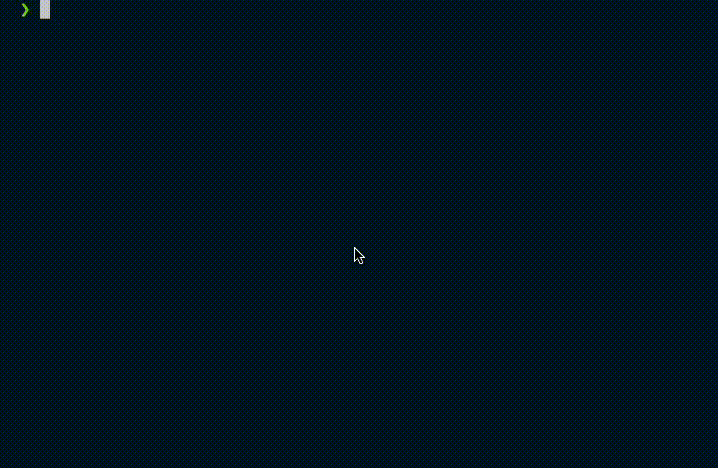

<p align="center">
  <a href="" rel="noopener">
 </a>
</p>

<h3 align="center">Simple Calculator</h3>

---



<p align="center"> Simple calculator CLI with basic capabilities.
    <br> 
</p>

## 📝 Table of Contents

- [About](#about)
- [Getting Started](#getting_started)
- [Usage](#usage)
- [Built Using](#built_using)
- [Authors](#authors)
- [Acknowledgments](#acknowledgement)

## 🧐 About <a name = "about"></a>

Calculator CLI which has basic operations:
- add
- subtract 
- multiply 
- divide 
- cancel 
- exit
- abs (absolute value)
- neg (negate the value)
- sqrt (square root)
- sqr(raise to the power of 2)
- cubert (cube root) 
- cube (raise to the power of 3)
- repeat (previous n commands) as commands
So that we can do basic mathematics.

All commands / operations is case insensitive, and invalid operations would not be counted as historical input. 

## 🏁 Getting Started <a name = "getting_started"></a>

To run this project, you need to install Golang in your machine

### Installing

To setup all package needed, run the command below

```
make setup
make init
```

## 🔧 Running the tests <a name = "tests"></a>


### Break down into end to end tests

To run all unit tests, just run the command below
```
make test
```

### And coding style tests

if you wanna add more operations in this code. 
just implement the Operation interface

```
type Operation interface {
		Do(in Input)
}
```
and add the implementation for the new operation
```
ops := map[OperationType]Operation{
  . . .
  DIVIDE:    NewDivide(state),
  CANCEL:    NewCancel(state),
  . . .
}
```
to add more mocking for testing, register your file contained interface in Makefile
```
. . .
mock:
	mockgen -source=operation.go -destination=operation_mock.go -package=main
. . .
```
## 🎈 Usage <a name="usage"></a>

To use this calculator, you can run it directly through code file
```
make run
```
or, you can run thru built session .

Then, just playing around with the commands

```
ADD       OperationType = "add"
SUBSTRACT OperationType = "subtract"
MULTIPLY  OperationType = "multiply"
DIVIDE    OperationType = "divide"
CANCEL    OperationType = "cancel"
ABS       OperationType = "abs"
NEG       OperationType = "neg"
SQRT      OperationType = "sqrt"
SQR       OperationType = "sqr"
CUBERT    OperationType = "cubert"
CUBE      OperationType = "cube"
EXIT      OperationType = "exit"
REPEAT    OperationType = "repeat"
```
To exit your calculator, type in *exit* in your running CLI.

## ⛏️ Built Using <a name = "built_using"></a>

- [Golang](https://go.dev/) - Main Programming Language

to build this program into binary file, run the command below
```
make build
```
to execute the binary file, run the command below
```
make exec
```

## ✍️ Authors <a name = "authors"></a>

- [@calman](https://github.com/Calmantara) - Idea & Initial work

Feel free to contribute in this project to add more advanced calculator features

## 🎉 Acknowledgements <a name = "acknowledgement"></a>

- Coffee for the inspiration
